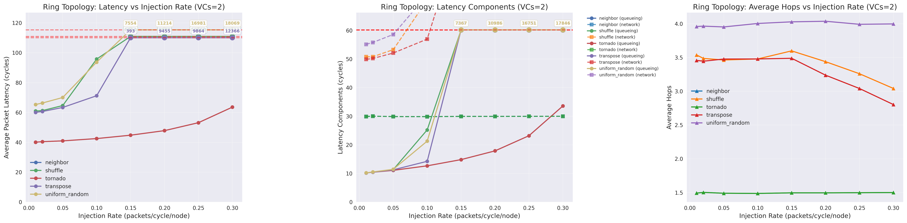
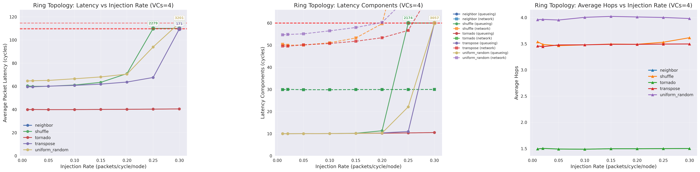
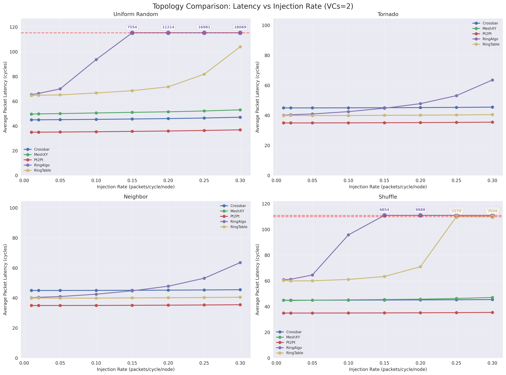
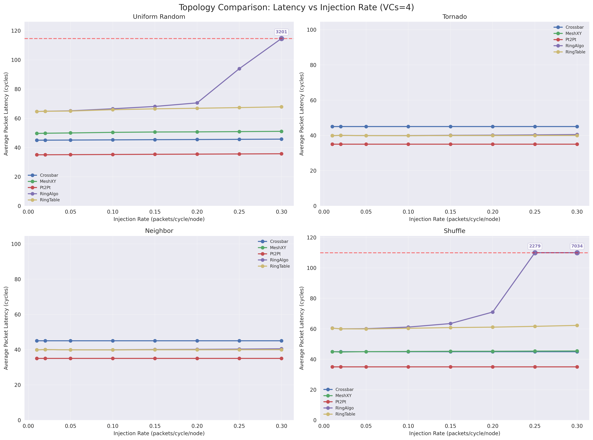
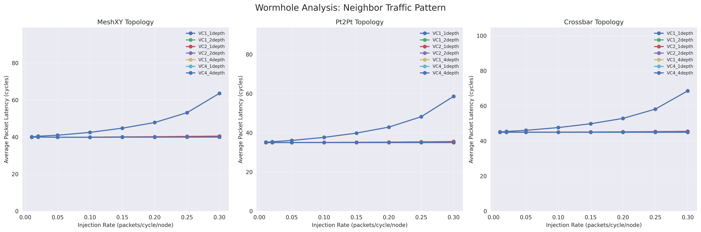
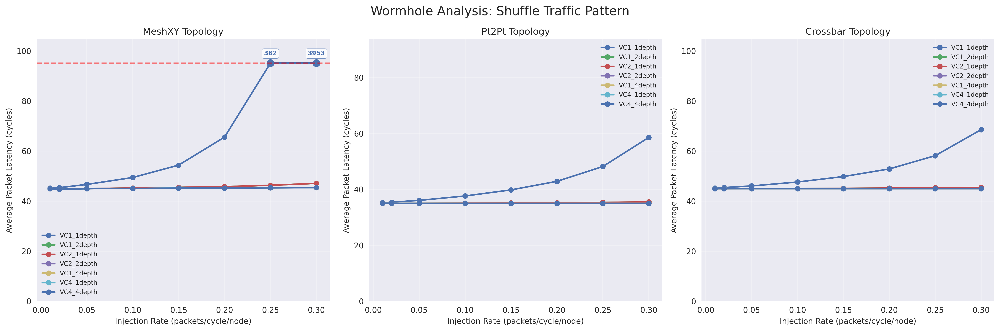
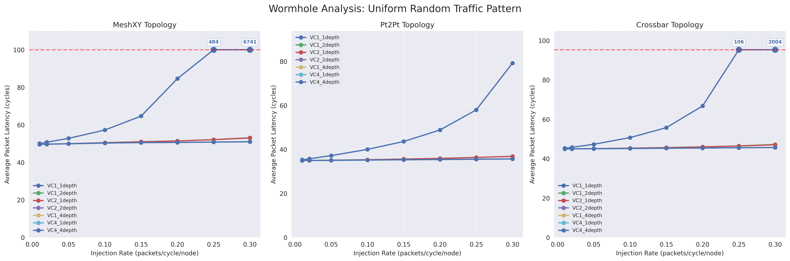

## Task 1 Implement ring

### Topology

This is simple, I connect each router to its two neighbors, forming a ring topology.

### Routing

#### Minimal Routing

I simply choose the minimal clock to route.

See code
```cpp
int
RoutingUnit::outportComputeRing(RouteInfo route, int inport,PortDirection inport_dirn)
{
    int my_id = m_router->get_id();
    int dest_id = route.dest_router;
    int num_nodes = m_router->get_net_ptr()->getNumRouters();

    // Calculate clockwise and counter-clockwise distances
    int clockwise_dist = (dest_id - my_id + num_nodes) % num_nodes;
    int counter_clockwise_dist = (my_id - dest_id + num_nodes) % num_nodes;

    // If we're at the destination, this shouldn't be called
    assert(clockwise_dist != 0);

    // pick closest one
    if (clockwise_dist <= counter_clockwise_dist) {
        assert(inport_dirn == "Local" || inport_dirn == "Left");
        return m_outports_dirn2idx["Right"];
    } else {
        assert(inport_dirn == "Local" || inport_dirn == "Right");
        return m_outports_dirn2idx["Left"];
    }
}
```

#### Deadlock-free VC control

I implement a virtual channel (VC) control mechanism that ensures no deadlocks occur in the network.

1. All virtual nets are divided into **two layers**.

See code in `OutputUnit.cc`:

```cpp

bool
OutputUnit::has_free_vc_ring(int vnet, int vc_layer, int vc_offset)
{
    int vc_base = vnet*m_vc_per_vnet;
    for (int vc = vc_base + vc_layer;
        vc < vc_base + m_vc_per_vnet; vc += vc_offset) {
        if (is_vc_idle(vc, curTick()))
            return true;
    }

    return false;
}

int
OutputUnit::select_free_vc_ring(int vnet, int vc_layer, int vc_offset)
{
    int vc_base = vnet*m_vc_per_vnet;
    for (int vc = vc_base + vc_layer;
        vc < vc_base + m_vc_per_vnet; vc += vc_offset) {
        if (is_vc_idle(vc, curTick())) {
            outVcState[vc].setState(ACTIVE_, curTick());
            return vc;
        }
    }

    return -1;
}

```

2. When injected to the network, a packet is assigned to any VC in layer $0$.

See code in `NetworkInterface.cc/ComputeVC()`:
```patch

     for (int i = 0; i < m_vc_per_vnet; i++) {
         int delta = m_vc_allocator[vnet];
         m_vc_allocator[vnet]++;
         if (m_vc_allocator[vnet] == m_vc_per_vnet)
             m_vc_allocator[vnet] = 0;

+        if ((delta&1)&&is_ring)
+            continue;
+
         int vc_id = (vnet*m_vc_per_vnet) + delta;

         if (is_wormhole) {
```

3. A packet will go be transfered to VC in layer $1$, if and only if it is setting off from router $0$.

See code in `SwitchAllocator.cc`:

```cpp
bool
SwitchAllocator::send_allowed_ring(int inport, int invc, int outport, int outvc)
{
    // Check if outvc needed
    // Check if credit needed (for multi-flit packet)
    // Check if ordering violated (in ordered vnet)

    int vnet = get_vnet(invc);
    bool has_outvc = (outvc != -1);
    bool has_credit = false;
    // invc 0,2,4..., need change, vc_layer=1
    // invc 1,3,5..., need change, vc_layer=0
    // int vc_layer = (invc&1)^(needs_vc_layer_transition_ring(inport, invc, outport, m_router, m_vc_per_vnet) ? 1 : 0);
    bool vc_layer = (invc&1)|(needs_vc_layer_transition_ring(inport, invc, outport, m_router, m_vc_per_vnet) ? 1 : 0);
    int vc_offset = 2;

...
}

bool
SwitchAllocator::needs_vc_layer_transition_ring(int inport, int invc, int outport, Router* router, int vc_per_vnet)
{
    // Check if this is router 0 (dateline) and packet came from left (router num_nodes-1)
    int my_id = router->get_id();
    return my_id == 0;
}


```


### Analysis

#### Comparing Different Traffic Patterns under Ring

The code is like
```bash
./build/NULL/gem5.opt \
            configs/example/garnet_synth_traffic.py \
            --network=garnet --num-cpus=$num_cpus \
            --num-dirs=$num_dirs \
            --topology=Ring \
            --routing-algorithm=2 \
            --vcs-per-vnet=$vcs \
            --inj-vnet=0 --synthetic=$pattern \
            --sim-cycles=$sim_cycles \
            --garnet-deadlock-threshold=$sim_cycles \
            --injectionrate=$rate \
            --global-frequency=10GHz \
```

And the we can draw figure like,

With 2 VCs (this routing for ring requires at least two VCs):



With 4 VCs.



We can see that:
1. Both **tornado** and **neighbor** enjoys a smallest latency and larger saturate point compared to other patterns.
2. **Uniform random** and **shuffle** exhibit higher latencies, especially under heavy loads.
3. Increasing the number of VCs generally helps to reduce latency, but the improvement varies by traffic pattern.
4. With a small number of VC, the avg hops for some traffic may drop. This is basically because only packets with small hops can reach their destination.

#### Comparing Ring to different topologies

See figure with $2$ VCs ,
and figure with $4$ VCs .


We find that ring performes worse compared to different topologies. In particular, the ring topology exhibits higher latencies and lower throughput under various traffic patterns, especially as the injection rate increases.

The most significant reason is that: with single-direction routing, a packet is easily blocked by other packets, leading to increased contention and delays.

I read the debug info of the running network, and find the packets forms a blocking chain, where each packet is waiting for the previous one to be forwarded, the packet in the first router may never get out, since there are continous packets injected to the router afterward.

## Task 2 Implement Wormhole flow control

### Implementation

The implementation is taken by two steps,

1. The `depth` (or `max_credit_count`) of each virtual channel (VC) is increased to the `wormhole` parameter.

See code

```patch
@@ -59,6 +59,14 @@ OutVcState::OutVcState(int id, GarnetNetwork *network_ptr,
     else
         m_max_credit_count = network_ptr->getBuffersPerCtrlVC();

+    // Override buffer depth for wormhole flow control
+    if (network_ptr->depthWormhole()) {
+        // Wormhole mode: use specified buffer depth
+        m_max_credit_count = network_ptr->depthWormhole();
+        // DPRINTF(WORMHOLE, " [DEBUG WORMHOLE] Num of wormhole is %d", m_max_credit_count);
+    }
+
     m_credit_count = m_max_credit_count;
     assert(m_credit_count >= 1);
 }
```


2. To allow a VC to receive different packets, the `VC_state` is discarded, and we decide the outport flit-wise, instead of vc-wise.

See following code as some examples of modifications.
```patch
@@ -97,10 +97,25 @@ OutputUnit::has_credit(int out_vc)
 bool
 OutputUnit::has_free_vc(int vnet)
 {
+    // In wormhole mode, we need to check if VC has enough buffer space
+    // rather than requiring it to be completely idle
+    bool is_wormhole = false;
+    if (m_router->get_net_ptr() != nullptr) {
+        is_wormhole = m_router->is_wormhole_enabled();
+    }
+
     int vc_base = vnet*m_vc_per_vnet;
     for (int vc = vc_base; vc < vc_base + m_vc_per_vnet; vc++) {
-        if (is_vc_idle(vc, curTick()))
-            return true;
+        if (is_wormhole) {
+            // In wormhole mode, check if VC has enough credits for the new flit
+            if (outVcState[vc].get_credit_count() > 0) {
+                return true;
+            }
+        } else {
+            // Traditional mode - VC must be idle
+            if (is_vc_idle(vc, curTick()))
+                return true;
+        }
     }
 }

@@ -123,7 +123,18 @@ SwitchAllocator::arbitrate_inports()
             if (input_unit->need_stage(invc, SA_, curTick())) {
                 // This flit is in SA stage

-                int outport = input_unit->get_outport(invc);
+                int outport;
+                // In wormhole mode, get outport from flit; in traditional mode, from VC
+                bool is_wormhole = false;
+                if (m_router->get_net_ptr() != nullptr) {
+                    is_wormhole = m_router->is_wormhole_enabled();
+                }
+                if (is_wormhole) {
+                    flit *t_flit = input_unit->peekTopFlit(invc);
+                    outport = t_flit->get_outport();
+                } else {
+                    outport = input_unit->get_outport(invc);
+                }


```
### Analysis

I iterate $VCs$ and $depth$ from $1,2,4$, and compared them under different traffic patterns under different topologies.

I did not choose $VC=16$ or $depth=16$ because they make no difference in performance in this setting.

The figure is like








One can find:

1. Both wormhole and VC can help decrease latency, and their effectiveness is almost the same.

2. A slight difference can be observed between $wormhole=2$ and $VC=2$, because wormhole flow control observes FIFO for each VC, while all VCs are parallel to each other.
