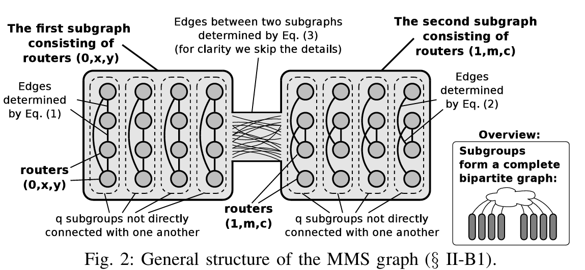
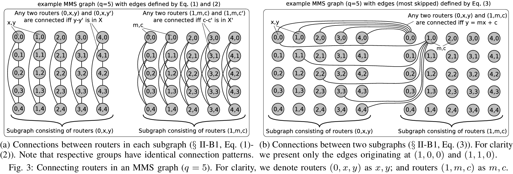
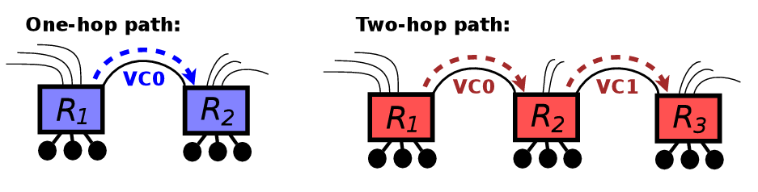
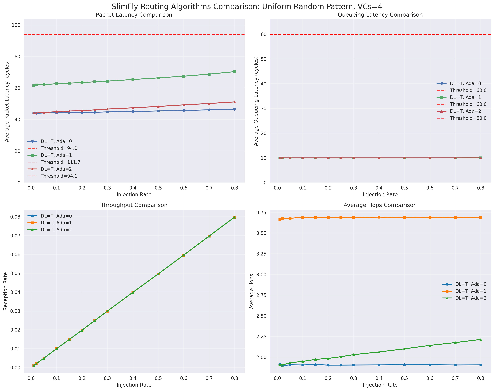
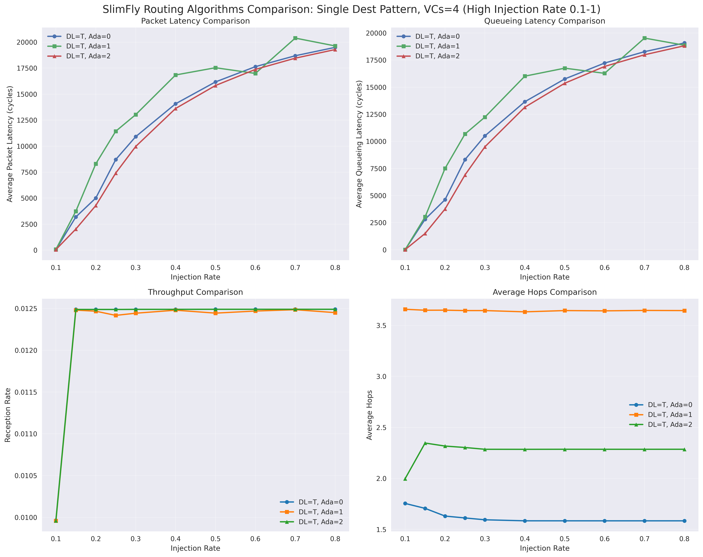
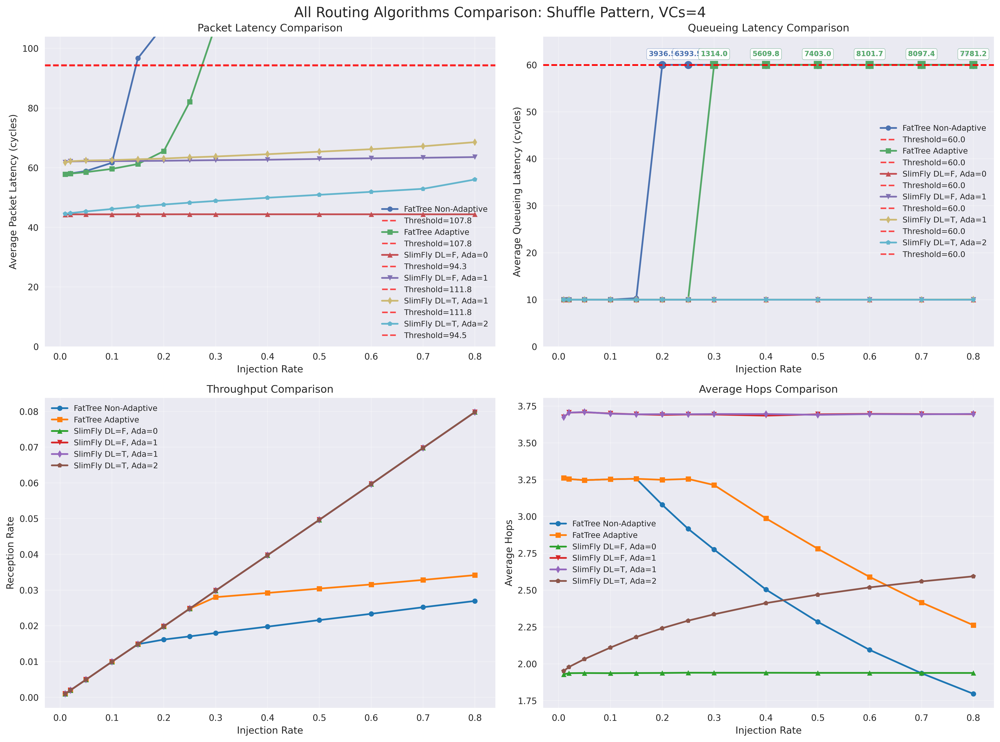

# Lab4: Self-implement Topology and Routing in Garnet

## 1 Intro

We implement the FatTree and the SlimFly topology, as well as their minimal and adaptive routing algorithms in Garnet. We also run experiments to compare the performance of these two topologies  under different traffic patterns.

<!-- [TBD] -->
They connect since they're both low-diameter, high-bandwidth network topologies.

## 2 FatTree

<!-- almost the same as https://github.com/xh092113/NoC-Project -->

### 2.1 Topology

- intro and figure
- properties
- implementation

### 2.2 Routing Algorithms

- minimal
- adaptive

## 3 SlimFly

<!-- see https://spcl.inf.ethz.ch/Research/Scalable_Networking/SlimFly/ -->

### 3.1 Topology

#### 3.1.1 Intro

SlimFly is a low-diameter network topology based on a certain graph (MMS graph). It is designed to exploit the Moore's Law to minimize the number of hops between nodes, thereby reducing latency and improving overall network performance.

By some mathematical properties of the MMS graph, SlimFly boasts a diameter of 2 with a relatively small number of radix.

Intuitively, the SlimFly topology can be visualized as two groups of nodes. Within each group, nodes are connected by columns in a highly regular pattern. Between the two groups, nodes are connected densely, each node in one group connecting to a line of nodes in the other group. This structure allows for efficient communication both within and between groups, where any two nodes can reach each other in at most $2$ hops.

#### 3.1.2 Details for Intuition

Due to different number of nodes, the structure of the topology varies. We take a example of $q=5$ to illustrate the implementation.

In this case, there are $2q^2=50$ routers, each with a radix of $r=\frac{3q-1}{2}=7$. Each router connects to $p=\frac{q-1}{2}=2$ nodes. The routers are divided into two groups, each containing $q^2=25$ routers.

Then, we find a primitive element $\epsilon$ of the Galois field $F_q$, and construct two generator sets $X=\{1, \epsilon^2, ...\}$ and $X'=\{\epsilon, \epsilon^3, ...\}$. In this case, $3$ is a primitive element of $F_5$. Next, we construct two generator sets $X=\{2,3\}$ and $X'=\{1,4\}$.

Then we connect the routers in $\{0,1\}\times F_q \times F_q $ according to the following rules:
1. Router $(0,x,y)$ is connected to $(0,x,y')$ if $y-y' \in X$.
2. Router $(1,x,y)$ is connected to $(1,x,y')$ if $y-y' \in X'$.
3. Router $(0,x,y)$ is connected to $(1,x',y')$ if $y = xy' + x'$. Meaning that $(0,x,y)$ is connected to a straight line of nodes $(1,x',y')$.

Then we will obtain the following topology:

And the minimal paths between any two nodes can be found according to the following table:

| # | From → To         | Condition                          | Shortest Path (vertex sequence)   | Length |
| - | ----------------- | ---------------------------------- | --------------------------------- | ------ |
| 0 | (0,x,y) → (1,m,c) | y = m x + c (incident)             | (0,x,y) → (1,m,c)                 | 1      |
| 1 | (0,x,y) → (1,m,c) | y ≠ m x + c and (c − (y−m x)) ∈ X′ | (0,x,y) → (1,m, y−m x) → (1,m,c)  | 2      |
| 2 | (0,x,y) → (1,m,c) | y ≠ m x + c and ((m x +c)−y) ∈ X   | (0,x,y) → (0,x, m x +c) → (1,m,c) | 2      |
| 3 | (0,x,y) → (0,m,c) | x = m and c−y ∈ X                  | (0,x,y) → (0,m,c)                 | 1      |
| 4 | (0,x,y) → (0,m,c) | x = m and c−y ∉ X                  | (0,x,y) → (0,x, y+s) → (0,m,c) \* | 2      |
| 5 | (0,x,y) → (0,m,c) | x ≠ m                              | (0,x,y) → (1,k,d) → (0,m,c) \*\*  | 2      |

\*  where $s\in X$ satisfies $(c−y)−s \in X$ (always exists, diameter $Cay(𝔽_q^+,X)=2)$.

** where $k=(y−c)/(x−m)$, $d=y−k x$.

### 3.2 Routing Algorithms

#### 3.2.1 Minimal
Though the diameter of SlimFly is $2$, the MMS graph does not provide the contruction of all the shortest paths. However, we can still find a shortest path between any two nodes by the Floyd-Warshall algorithm.

Then, we implement the minimal routing algorithm by storing all the shortest paths in a table. When a packet arrives, we look up the table to find the next hop.

#### 3.2.2 VAL

The Valiant Random Routing (VAL) algorithm is a classic adaptive routing algorithm that helps to avoid congestion and improve load balancing in networks.It routes packets through a randomly chosen intermediate node before reaching their final destination.

In the context of the SlimFly topology, it increases the minimal path length from $2$ to $4$, but it helps to distribute the traffic more evenly across the network.

#### 3.2.3 Congestion-Aware Adaptive

Inspired by the UGAL algorithm, we implement a simple adaptive routing algorithm that dynamically chooses between minimal and non-minimal paths based on current network conditions.

When a packet arrives, we first look up the minimal path.
- If the next hop is not congested, we send the packet along the minimal path.
- If it faces congestion in the next hop, we send the packet to any other outport that faces no congestion. Then we continue along the minimal path from there, and do no more adaptive routing for this packet.
- If all outports are congested, we follow the minimal path.

Note that in this simple implementation, we only increases the average hops by at most one, since one flit can be adaptively routed only once. And that we only consider the congestion of the next hop, and do not look ahead further.

Then, we randomly select a non-minimal path that goes through an intermediate node. We compare the congestion levels (measured by the buffer size of the output port) of the two paths. If the non-minimal path is less congested than the minimal path by a certain threshold, we choose the non-minimal path; otherwise, we stick to the minimal path.

#### 3.2.4 Deadlock Avoidance

Containing cycles, the SlimFly topology is prone to deadlocks. To avoid deadlocks, we employ virtual channels to avoid cyclic dependencies.

For the minimal routing, since the minimal hops is $2$, we simply applied two virtual channels to seperate the first hop and the second hop.

For the adaptive routing, we applied $4$ virtual channels for the $4$ possible hops in order to avoid deadlocks.

<!-- [TBD] still running -->
## 4 Experiments

### 4.1 Fattree min vs adaptive

### 4.2 Slimfly min vs VAL vs adaptive

See this figure, we compare the performance of the three routing algorithms under uniform random.

One can see from the figure that:
- They have obviously different average hops. For the minimal routing, the average hops lower than $2$. For the VAL routing, the average hops is around $4$. For the congestion-aware adaptive routing, the average hops increases slightly when congestion increases, but is still lower than $3$.
- They have similar queueing latency, since the network dense, not easy to be congested under this traffic pattern.

The following figure shows the performance under single-destination.

One can see from the figure that:

- At this senario, the network is heavily congested. The congestion-aware adaptive routing has the lowest queueing latency, since it can adaptively avoid congested paths.

- However, the VAL routing has the highest queueing latency, since it cannot avoid congested paths to the destination.

### 4.3 Fattree vs Slimfly

See the following figure, we compare the performance of the two topologies under shuffle traffic pattern, both using $4$ VCs and different routing algorithms.

One can find from the figure that:
- The SlimFly topology originally has lower average hops than the FatTree topology, since it has a smaller diameter. Later there is a hop drop in the FatTree topology, since it enters the saturated region and some packets are dropped.
- The SlimFly topology has lower queueing latency than the FatTree topology, since it has higher bisection bandwidth.
- The FatTree topology has a much smaller saturation point than the SlimFly topology.

## 5 Conclusion
